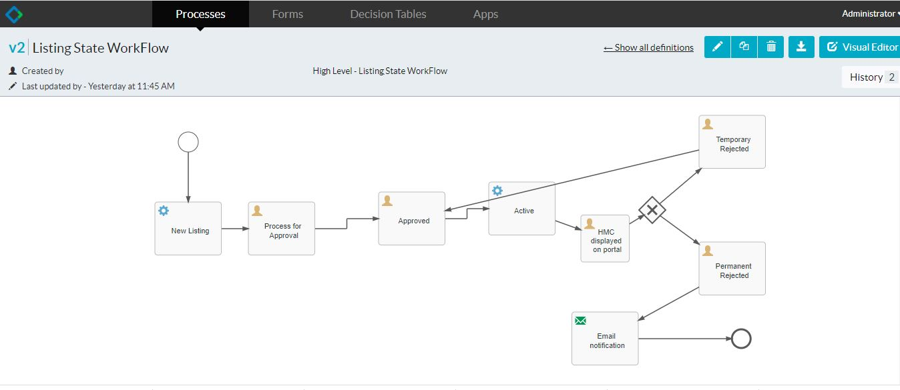
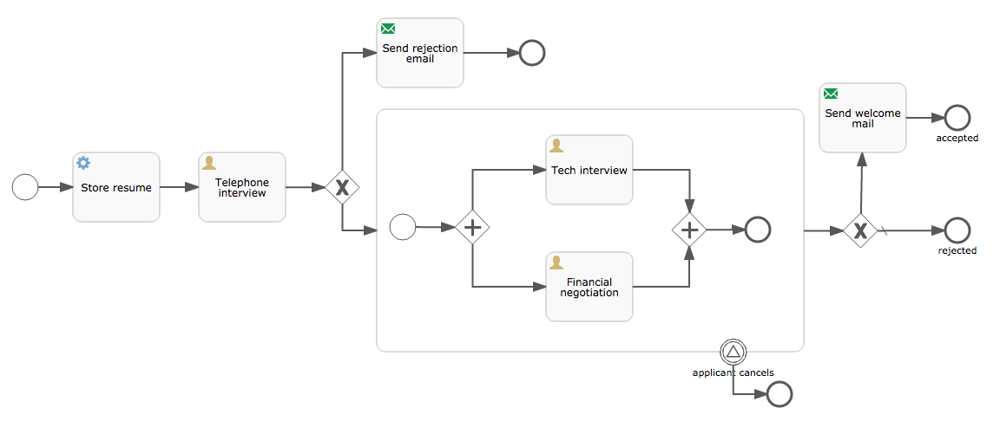

# Quickstart
## Preface
This document will describe how to get started with activiti and spring-boot.   

## Introduction
Activiti is an Apache-licensed business process management (BPM) engine. Such an engine has as core goal to take a process definition comprised of human tasks and service calls and execute those in a certain order, while exposing various API�s to start, manage and query data about process instances for that definition. Contrary to many of its competitors, Activiti is lightweight and integrates easily with any Java technology or project. All that, and it works at any scale - from just a few dozen to many thousands or even millions of process executions.

The project was founded and is sponsored by [Alfresco](http://www.alfresco.com/), but enjoys contributions from all across the globe and industries.

A process definition is typically visualized as a flow-chart-like diagram. In recent years, the BPMN 2.0 standard (an OMG standard, like UML) has become the de-facto �language� of these diagrams. This standard defines how a certain shape on the diagram should be interpreted, both technically and business-wise and how it is stored, as a not-so-hipster XML file.. but luckily most of the tooling hides this for you. This is a standard, and you can use any number of compliant tools to design (and even run) your BPMN processes. That said, if you�re asking me, there is no better choice than Activiti!

## Spring Boot integration
Activiti and Spring play nicely together. The convention-over-configuration approach in Spring Boot works nicely with Activiti�s process engine is setup and use. Out of the box, you only need a database, as process executions can span anywhere from a few seconds to a couple of years. Obviously, as an intrinsic part of a process definition is calling and consuming data to and from various systems with all kinds of technologies. The simplicity of adding the needed dependencies and integrating various pieces of (boiler-plate) logic with Spring Boot really makes this child�s play.

Using Spring Boot and Activiti in a microservice approach also makes a lot of sense. Spring Boot makes it easy to get a production-ready service up and running in no time and - in a distributed microservice architecture - Activiti processes can glue together various microservices while also weaving in human workflow (tasks and forms) to achieve a certain goal.

The Spring Boot integration in Activiti was created by Spring expert [Josh Long](https://twitter.com/starbuxman). Josh and I [did a online webinar](https://www.youtube.com/watch?v=0PV_8Lew3vg) that should give you a good insight into the basics of the Activiti integration for Spring Boot. The [Activiti user guide section on Spring Boot](http://activiti.org/userguide/index.html#springSpringBoot) is also a great starting place to get more information.

## Getting Started

```
POST Request 

http://localhost:8081/new-listing-process
Body:- {"name":"Sudhanshu", "email": "sudhanshu@gmail.com", "phoneNumber":"123456789","noOfRooms":45}

Get all processes 
http://localhost:8081/runtime/tasks?includeProcessVariables=true


On the basis of url and current process
POST Request http://localhost:8081/runtime/tasks/19
Body:- {"action" : "complete",  "variables": [ {"name":"hotelListingApprovalStatus", "value":true} ]}

Go For Next step process,
Check the next process using the url 
http://localhost:8081/runtime/tasks?includeProcessVariables=true

http://localhost:8081/runtime/tasks/24
{"action" : "complete",  "variables": [ {"name":"hotelActive", "value":true} ]}


Login to Actiti APP run the war files in tomcat deployed in Webapps folder.

Open the URL - http://localhost:8080/activiti-app/
username:- admin
password:- test


```
Download the [Activiti] 
(https://github.com/Activiti/Activiti/releases/download/activiti-6.0.0/activiti-6.0.0.zip)


 
Copy the war files from activiti-6.0.0\wars directory 

Download the [Tomcat](http://apachemirror.wuchna.com/tomcat/tomcat-8/v8.5.57/bin/apache-tomcat-8.5.57-windows-x64.zip)

Put in Tomcat folder apache-tomcat-8.5.57-windows-x64\apache-tomcat-8.5.57\webapps 

and Run the application apache-tomcat-8.5.57\bin\startup.bat or for linux env startup.sh
 

The code for this example can be [found in my Github repository](https://github.com/sudhanshubliz/spring-boot-activiti-h2db-integration).

The process well implement here is a hiring process for a developer. Its simplified of course (as it needs to fit on this web page), but you should get the core concepts. Heres the diagram:



As said in the introduction, all shapes here have a very specific interpretation thanks to the BPMN 2.0 standard. But even without knowledge of BPMN, the process is pretty easy to understand:

* When the process starts, the resume of the job applicant is stored in an external system.
* The process then waits until a telephone interview has been conducted. This is done by a user (see the little icon of a person in the corner).
* If the telephone interview wasn�t all that, a polite rejection email is sent. Otherwise, both a tech interview and financial negotiation should happen.
* Note that at any point, the applicant can cancel. That�s shown in the diagram as the event on the boundary of the big rectangle. When the event happens, everything inside will be killed and the process halts.
* If all goes well, a welcome email is sent.

This is the [BPMN for this process](https://github.com/jbarrez/spring-boot-with-activiti-example/blob/master/src/main/resources/processes/Developer_Hiring.bpmn20.xml)
(https://github.com/sudhanshubliz/spring-boot-activiti-h2db-integration/blob/master/src/main/resources/processes/Listing_State_WorkFlow.bpmn20.xml)
 